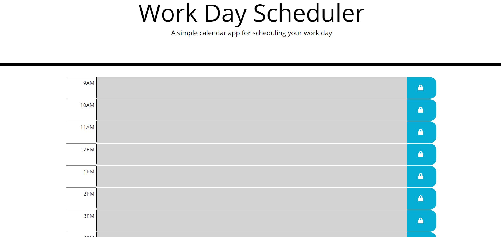

# Campbell Calendar is a file that has been modified based on the original start code. Some changes include but are not limited to:
 - Added a grid system with rows and columns to track hours of the workday
 - Input & organized div elements to denote blocks in the calendar grid
 - Added text functionality so that users can click and block and add text
 - Identifying hour labels for each row
 - Leveraged Open Iconic to add symbol for saving each text field
 - Coloring scheme to track hours during the day in real time

 Deployed application can be found at: https://campbefs.github.io/campbell-calendar/

 